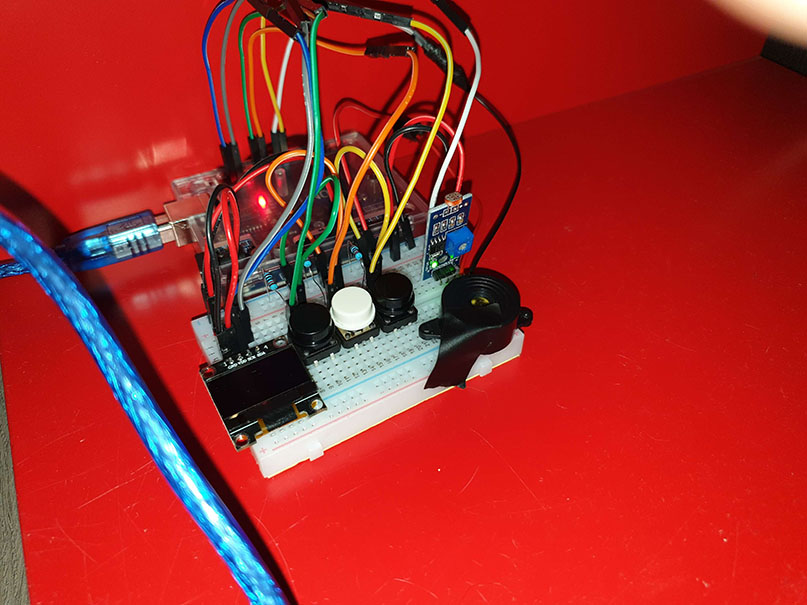
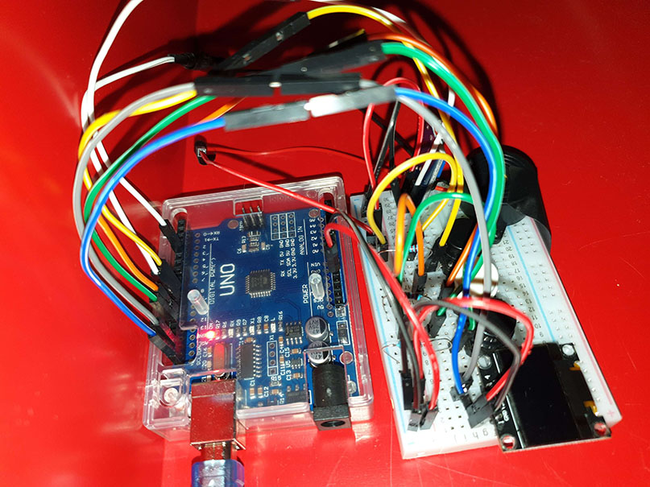
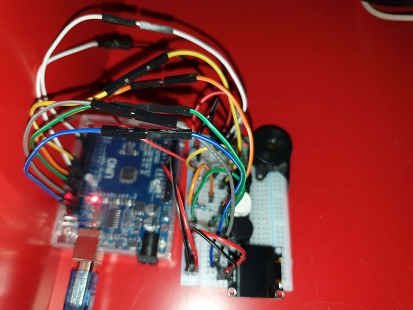
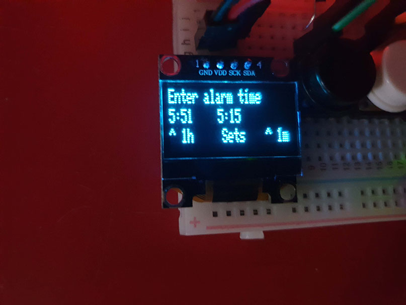

# Arduino Light Dependant Alarm

An alarm that turns off when the lights are turned on.

## Features

* Set the time on first boot
* See current time on display
* See the next alarm on display
* Ability to set an alarm
* Once the alarm goes off, plays a sound until the lights turn on

## Components

* [LDR Module](https://aliexpress.com/item/2pcs-lot-Photoresistor-Photoelectric-Sensor-Module-Detects-Light-Sensitive-Photodiode/32452315745.html?spm=a2g0z.search0104.3.1.e6342bc9cebQhe&ws_ab_test=searchweb0_0,searchweb201602_7_10065_10068_10843_319_10059_10884_317_10887_10696_321_322_453_10084_454_10083_10103_10618_10304_10307_10820_10301_10821_537_536,searchweb201603_52,ppcSwitch_0&algo_expid=00ff9f18-4a8c-4eb4-956e-4b6e1e5f0091-0&algo_pvid=00ff9f18-4a8c-4eb4-956e-4b6e1e5f0091&transAbTest=ae803_5)
* [Piezo Buzzer](https://aliexpress.com/item/Hot-Sale-Newest-Useful-New-Arrival-Durable-3-24V-Piezo-Electronic-Buzzer-Alarm-95DB-Continuous-Sound/32783807336.html?spm=a2g0z.search0104.3.1.1b6e4788xBsUxP&ws_ab_test=searchweb0_0,searchweb201602_7_10065_10068_10843_319_10059_10884_317_10887_10696_321_322_453_10084_454_10083_10103_10618_10304_10307_10820_10301_10821_537_536,searchweb201603_52,ppcSwitch_0&algo_expid=37149eb8-7996-409f-bab4-714ae6c61c7b-0&algo_pvid=37149eb8-7996-409f-bab4-714ae6c61c7b&transAbTest=ae803_5)
* [OLED 0.96 inch LCD display](https://aliexpress.com/item/0-96-inch-IIC-Seri-le-Witte-OLED-Display-Module-128X64-I2C-SSD1306-12864-Lcd-scherm/32896971385.html?spm=a2g0z.search0104.3.1.6c476afbkjxdLE&transAbTest=ae803_5&ws_ab_test=searchweb0_0%2Csearchweb201602_7_10065_10068_10843_319_10059_10884_317_10887_10696_321_322_453_10084_454_10083_10103_10618_10304_10307_10820_10301_10821_537_536%2Csearchweb201603_52%2CppcSwitch_0&algo_pvid=5c7f716b-d97c-43b6-87d7-5ff61a5e272f&algo_expid=5c7f716b-d97c-43b6-87d7-5ff61a5e272f-0)
* [3 Push buttons](https://aliexpress.com/item/25-stks-12X12mm-Grote-sleutel-module-Grote-knop-module-Light-touch-switch-module-met-hoed-Hoge/32951161227.html?spm=a2g0s.9042311.0.0.487e4c4dLH0Owj)
* [Wires](https://aliexpress.com/item/Free-shipping-Dupont-line-40pcs-10cm-male-to-male-jumper-wire-Dupont-cable-breadboard-cable-jump/32700513558.html?spm=a2g0s.9042311.0.0.27424c4dueZN5i)
* [3 10k Ohm resistors](https://aliexpress.com/item/100pcs-10k-ohm-1-4W-10k-Metal-Film-Resistor-10kohm-0-25W-1-ROHS/32577051768.html?spm=a2g0z.search0104.3.15.4d577d87IffTm8&ws_ab_test=searchweb0_0,searchweb201602_7_10065_10068_10843_319_10059_10884_317_10887_10696_321_322_453_10084_454_10083_10103_10618_10304_10307_10820_10301_10821_537_536,searchweb201603_52,ppcSwitch_0&algo_expid=82a48e2b-2e64-4414-bd46-6b444e2ab996-2&algo_pvid=82a48e2b-2e64-4414-bd46-6b444e2ab996&transAbTest=ae803_5)
* [Arduino Uno](https://aliexpress.com/item/high-quality-One-set-UNO-R3-CH340G-MEGA328P-for-Arduino-UNO-R3-NO-USB-CABLE/32697443734.html?spm=a2g0s.9042311.0.0.27424c4dueZN5i)
* [Breadboard](https://aliexpress.com/item/1-Pcs-New-400-Tie-Points-Solderless-PCB-Breadboard-Mini-Universal-Test-Protoboard-DIY-Bread-Board/32523562738.html?spm=a2g0s.9042311.0.0.27424c4dueZN5i)

## Pictures

### Front view

### Side view 1

### Side view 2

### Display

## Credits

Thanks to [this](https://www.instructables.com/id/Game-Of-Thrones-Theme-on-Arduino/) article where i got the Game of Thrones sound from.